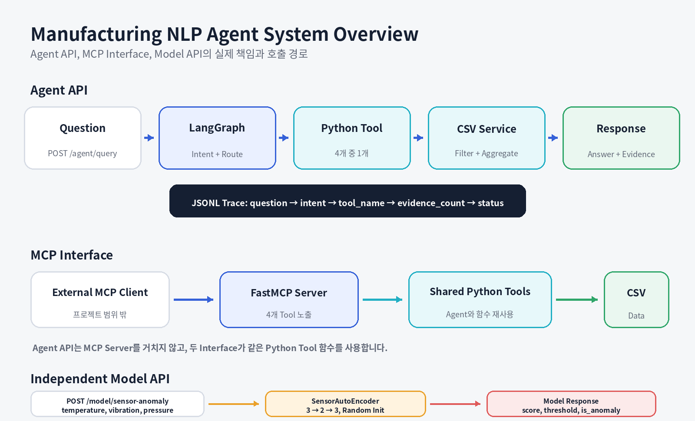
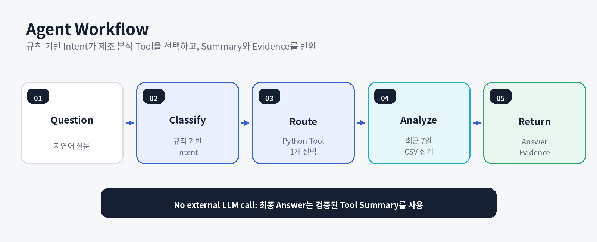

# 제조 품질 분석 NLP Agent
### Manufacturing MCP Agent

**Manufacturing Intent Routing, MCP Tools, Evidence, and FastAPI**

> 제조 자연어 질문을 Intent로 분류하고, 필요한 분석 Tool을 실행해 **Answer와 Evidence**를 반환하는 제조 데이터 분석 Agent 프로젝트입니다.

<p>
  
  
  
  
  
</p>

---

## Why This Project

제조 현장의 질문은 자연어로 입력되지만, 질문마다 필요한 데이터와 계산 방식이 다릅니다.

- 불량률 질문은 생산량과 불량 수량을 집계해야 합니다.
- 센서 이상 질문은 온도, 진동, 압력 기록을 확인해야 합니다.
- 라인 상태 질문은 생산성과 품질 정보를 함께 요약해야 합니다.
- 원인 후보 질문은 불량률과 센서 이상 정보를 조합하되 실제 원인으로 단정하지 않아야 합니다.

모든 질문을 하나의 함수나 고정 답변으로 처리하면 질문 해석, 데이터 계산, 답변 생성의 책임이 섞입니다. 또한 답변만 반환하면 어떤 데이터로 결론을 냈는지 확인하기 어렵습니다.

이 프로젝트는 다음 흐름을 분리해 구현했습니다.

```text
Question
→ Intent
→ Router
→ Manufacturing Tool
→ Summary and Evidence
→ API Response
```

`/agent/query`는 LangGraph 내부에서 Python Tool 함수를 직접 호출합니다. FastMCP Server는 같은 4개 분석 기능을 별도 Tool Interface로 노출하며, Agent API가 MCP Client를 통해 Server를 호출하는 구조는 아닙니다.

---

## Project Overview

| 항목 | 내용 |
|---|---|
| **기간** | 2026.04–05 |
| **형태** | 개인 프로젝트 |
| **목표** | 제조 자연어 질문을 분석 기능으로 연결하고, 답변과 근거 데이터를 함께 반환 |
| **범위** | 샘플 제조 데이터, 규칙 기반 Intent, Router, LangGraph, 4개 분석 Tool, FastMCP Server, FastAPI, JSONL Trace, PyTorch Model Endpoint, Docker, GitHub Actions, pytest |
| **NLP 범위** | 자연어 질문의 목적을 4개 Intent로 분류하고 처리 경로를 결정 |
| **기술** | Python, FastAPI, Pydantic, LangGraph, MCP FastMCP, pandas, SQLite, PyTorch, Docker, GitHub Actions |
| **구현 결과** | 4 Intents, 4 Agent Tools, 4 MCP Tools, 2 Core POST Endpoints + 1 Service Info Endpoint, 핵심 테스트 9개 |

---

## Problem → Implementation → Result

| Problem | Implementation | Result |
|---|---|---|
| 질문마다 필요한 계산 방식이 다름 | Intent와 Router를 두고 기능별 Tool 분리 | 4개 질문 유형을 4개 제조 분석 기능으로 연결 |
| 답변만으로 결과를 검증하기 어려움 | Tool이 Summary와 Evidence Row를 함께 반환 | API 응답에서 Answer와 계산 근거를 동시에 확인 |
| 여러 목적 표현이 섞이면 Routing이 달라질 수 있음 | 원인, 생산성, 불량, 센서 순서로 분류 우선순위 적용 | 복합 질문의 처리 규칙을 코드로 명시 |
| Agent API와 MCP의 관계가 혼동될 수 있음 | Agent는 Python Tool 직접 호출, MCP는 동일 함수를 별도 노출 | 내부 실행과 외부 Tool Interface 책임 분리 |
| 규칙 기반 Tool과 Model Endpoint가 한 흐름처럼 보일 수 있음 | `/agent/query`와 `/model/sensor-anomaly` 독립 구성 | 데이터 집계와 PyTorch 추론 범위 구분 |
| 실행 환경이 달라지면 검증이 어려움 | 샘플 데이터 생성, pytest, Docker, GitHub Actions 구성 | Local, Container, CI 실행 경로 제공 |

---

## System Overview



### Responsibility Separation

| Layer | Responsibility |
|---|---|
| **Intent** | 질문 목적을 `defect_rate`, `machine_anomaly`, `line_performance`, `quality_issue_candidates` 중 하나로 분류 |
| **Router** | Intent를 Python Tool 함수 이름에 연결 |
| **Manufacturing Tool** | CSV Loading, 기간 Filtering, Grouping, Aggregation 실행 |
| **Answer Builder** | Tool Summary를 최종 Answer로 사용 |
| **Evidence** | 계산에 사용한 행과 집계 결과를 구조화 |
| **JSONL Trace** | Question, Intent, Tool, Evidence Count, Status 기록 |
| **FastMCP Server** | 같은 4개 Tool 기능을 MCP Interface로 노출 |
| **Model API** | 3개 센서값의 Reconstruction Error와 이상 여부 반환 |

### Scope Clarification

- Agent Tool의 기본 데이터 경로는 CSV입니다.
- SQLite Schema와 Loader는 포함되어 있지만 현재 Agent Tool 실행 경로에는 연결되지 않습니다.
- 현재 Answer는 외부 LLM이 생성하지 않고 검증된 Tool Summary를 사용합니다.
- PyTorch Model Endpoint는 Agent의 `machine_anomaly` Tool과 독립적입니다.

---

## Practical Evaluation Criteria

Agent 프로젝트는 하나의 Accuracy 수치보다 **Routing, Tool 계약, Evidence, 실행 추적, Interface 책임 분리**를 함께 평가해야 합니다.

| 실무 관점 | 평가 기준 | 프로젝트에서 확인한 근거 |
|---|---|---|
| **Routing 일관성** | 대표 질문이 올바른 Intent와 Tool로 연결되는가 | Intent별 Agent Flow Test 4개 |
| **Tool 결과 안정성** | 각 Tool이 Summary와 Evidence를 반환하는가 | 제조 분석 Tool Test 4개 |
| **응답 검증 가능성** | Answer를 Evidence로 다시 확인할 수 있는가 | `question`, `intent`, `tool_name`, `answer`, `evidence` 구조 |
| **Tool 계약 명확성** | MCP Tool의 이름, 설명, 입력값이 구분되는가 | FastMCP 4개 Tool, `days` Argument |
| **실행 추적** | 어떤 질문이 어떤 Tool로 처리되었는가 | `logs/agent_trace.jsonl` |
| **책임 분리** | Agent, MCP, Model의 실제 호출 관계가 정확한가 | Agent 직접 호출, 별도 MCP Server, 독립 Model Endpoint |
| **재현성** | Sample Data와 Test를 같은 조건에서 실행할 수 있는가 | Python 3.11 CI, Docker, GitHub Actions |
| **범위 설명** | 규칙 기반 분류와 원인 후보를 과장하지 않는가 | No external LLM, Candidate 표현, Model 한계 명시 |

> 현재 공개 Test는 Agent Flow 4개, Tool 4개, PyTorch Service 1개입니다. FastAPI Endpoint 통합 Test와 MCP Protocol 통합 Test가 구현된 것으로 표현하지 않습니다.

---

## Intent and Tool Mapping

| Intent | Agent Tool | MCP Tool | Question Example |
|---|---|---|---|
| `defect_rate` | `get_defect_rate_by_line` | `defect_rate_by_line` | 최근 7일 불량률이 가장 높은 라인은? |
| `machine_anomaly` | `detect_machine_anomalies` | `machine_anomalies` | 설비 온도나 진동이 비정상적으로 높은 구간이 있어? |
| `line_performance` | `summarize_line_performance` | `line_performance` | 라인별 생산성과 품질 상태를 요약해줘. |
| `quality_issue_candidates` | `infer_quality_issue_candidates_tool` | `quality_issue_candidates` | 품질 이상 원인 후보를 데이터 근거와 함께 알려줘. |

### Routing Priority

```text
01. 원인, 후보, 왜 + 불량, 품질, 이상, defect
    → quality_issue_candidates

02. 생산성, 생산량, 라인별, 요약, performance
    → line_performance

03. 불량, defect, 불량률
    → defect_rate

04. 온도, 진동, 압력, 센서, 이상, anomaly
    → machine_anomaly

05. 일치하지 않음
    → line_performance
```

---

## Agent Workflow



| 단계 | 실제 처리 |
|---|---|
| **Question** | FastAPI가 자연어 질문을 입력받음 |
| **Classify** | `classify_intent()`가 규칙 기반 Intent 결정 |
| **Route** | `tool_map`이 Intent를 Python Tool 함수에 연결 |
| **Analyze** | 선택된 Tool을 `days=7`로 실행해 CSV 집계 |
| **Return** | Summary는 Answer, 집계 Row는 Evidence로 반환하고 Trace 기록 |

> `PromptTemplate`은 답변 정책을 구조화하지만 현재 외부 LLM을 호출하지 않습니다. Evidence가 없으면 근거 부족 안내를 반환합니다.

---

## Technical Details

<details open>
<summary><b>01 | Agent State and LangGraph</b></summary>

<br>

```text
question
→ intent
→ tool_name
→ tool_result
→ answer
→ evidence
```

```text
route_question
→ call_tool
→ build_answer
→ END
```

현재 Intent는 규칙 기반입니다. LLM을 학습하거나 LLM이 최종 수치와 Answer를 생성하는 프로젝트가 아닙니다.

</details>

<details>
<summary><b>02 | Manufacturing Data and Tools</b></summary>

<br>

| Data | Purpose |
|---|---|
| `production_logs.csv` | 라인별 생산량과 가동시간 |
| `quality_inspection.csv` | 검사 수량, 불량 수량, 불량 유형 |
| `machine_sensor_logs.csv` | 온도, 진동, 압력 센서 기록 |

```text
CSV Loading
→ Date Range Filtering
→ Line Grouping
→ Sum and Mean Aggregation
→ Defect Rate Calculation
→ Threshold-based Sensor Check
→ Evidence Row Construction
```

품질 이상 원인 후보는 실제 원인을 확정하지 않습니다. 불량률과 센서 이상을 조합해 우선 점검 대상을 제안합니다.

</details>

<details>
<summary><b>03 | FastMCP Server</b></summary>

<br>

```python
mcp = FastMCP("manufacturing-mcp-agent")

@mcp.tool()
def defect_rate_by_line(days: int = 7) -> dict:
    return get_defect_rate_by_line(days=days)

@mcp.tool()
def machine_anomalies(days: int = 7) -> dict:
    return detect_machine_anomalies(days=days)

@mcp.tool()
def line_performance(days: int = 7) -> dict:
    return summarize_line_performance(days=days)

@mcp.tool()
def quality_issue_candidates(days: int = 7) -> dict:
    return infer_quality_issue_candidates_tool(days=days)
```

MCP Layer는 분석 로직을 중복 구현하지 않고 같은 Python Tool 함수를 사용합니다.

</details>

<details>
<summary><b>04 | Independent PyTorch Model API</b></summary>

<br>

```text
temperature, vibration, pressure
→ Linear(3 → 2)
→ ReLU
→ Linear(2 → 3)
→ Reconstruction Error
→ Threshold 1000.0
→ is_anomaly
```

현재 `SensorAutoEncoder`는 학습된 Weight 없이 기본 초기화 상태로 생성됩니다. 이 Endpoint는 최소 Model Serving 구조와 Response Schema를 보여주며, 검증된 이상 탐지 성능을 의미하지 않습니다.

</details>

<details>
<summary><b>05 | Validation and CI</b></summary>

<br>

```text
tests/test_agent_flow.py     4 cases
tests/test_tools.py          4 cases
tests/test_torch_model.py    1 case
```

GitHub Actions는 Python 3.11 환경에서 Dependency 설치, Sample Data 생성, pytest 실행을 수행합니다.

</details>

---

## API

| Method | Endpoint | Role |
|---|---|---|
| `GET` | `/` | Service 상태와 Endpoint 안내 |
| `POST` | `/agent/query` | 자연어 질문을 Intent와 Tool로 연결 |
| `POST` | `/model/sensor-anomaly` | 3개 센서값의 Reconstruction Error 계산 |

### POST `/agent/query`

```json
{
  "question": "최근 7일간 불량률이 가장 높은 라인을 찾아줘."
}
```

```json
{
  "question": "최근 7일간 불량률이 가장 높은 라인을 찾아줘.",
  "intent": "defect_rate",
  "tool_name": "get_defect_rate_by_line",
  "answer": "최근 7일 기준 불량률이 가장 높은 라인은 LINE_C입니다.",
  "evidence": [
    {
      "line_id": "LINE_C",
      "output_qty": 1234,
      "defect_qty": 54,
      "avg_defect_rate": 0.0439
    }
  ]
}
```

### POST `/model/sensor-anomaly`

```json
{
  "temperature": 95.7,
  "vibration": 5.6,
  "pressure": 2.4
}
```

```json
{
  "temperature": 95.7,
  "vibration": 5.6,
  "pressure": 2.4,
  "anomaly_score": 1023.5,
  "threshold": 1000.0,
  "is_anomaly": true,
  "model": "SensorAutoEncoder",
  "note": "Reconstruction error based anomaly result"
}
```

> API 예시 수치는 Response 구조를 설명하기 위한 값입니다.

---

## Run and Verify

```powershell
python -m venv .venv
.\.venv\Scripts\Activate.ps1
python -m pip install -r .\requirements.txt
python .\scripts_generate_sample_data.py
python -m uvicorn app.main:app --reload
```

MCP Server:

```powershell
python -m app.mcp_server.server
```

Tests:

```powershell
python -m pytest .\tests -q
```

Docker:

```powershell
docker compose up --build
```

---

## Project Structure

```text
manufacturing-mcp-agent/
├── .github/workflows/ci.yml
├── app/
│   ├── agent/
│   ├── db/
│   ├── mcp_server/
│   ├── models/
│   ├── services/
│   ├── config.py
│   └── main.py
├── data/
├── docs/assets/
├── langflow/
├── tests/
├── Dockerfile
├── docker-compose.yml
├── pytest.ini
├── requirements.txt
├── scripts_generate_sample_data.py
└── README.md
```

---

## Current Scope and Limitations

### Current Scope

- 공개용 제조 Sample Data
- 규칙 기반 4개 Intent Classification
- LangGraph 3 Node Workflow
- pandas 기반 제조 데이터 집계
- Answer와 Evidence Response
- FastMCP Server 4 Tools
- JSONL Agent Trace
- FastAPI Agent Endpoint
- 독립 PyTorch Model Endpoint
- Docker와 GitHub Actions

### Limitations

- 외부 LLM을 호출하지 않음
- Intent 평가 Dataset과 Confusion Matrix가 없음
- `/agent/query`의 분석 기간은 `days=7`로 고정
- Agent API가 MCP Client를 통해 MCP Server를 호출하지 않음
- SQLite가 현재 Agent Tool 실행 경로에 연결되지 않음
- PyTorch AutoEncoder는 학습된 Weight를 사용하지 않음
- FastAPI와 MCP Protocol 통합 Test가 없음
- 인증, 권한, Timeout, Audit, Monitoring이 없음
- 원인 후보는 Rule 기반 점검 대상이며 실제 원인 진단이 아님

### Next Steps

1. Intent 정답 Dataset과 Confusion Matrix 추가
2. 규칙 기반 Intent와 LLM Structured Intent 비교
3. `days`와 Tool Argument를 Request Schema로 확장
4. FastAPI, MCP Protocol, Docker Build 통합 Test 추가
5. SQLite를 Tool Data Source 또는 실행 History로 연결
6. Model Training, Scaling, Validation Threshold 구현
7. Tool Timeout, Audit Log, 권한 제어 추가

---

## What This Project Demonstrates

- 자연어 제조 질문을 규칙 기반 Intent로 분류한 경험
- LangGraph State와 Node로 처리 단계를 분리한 경험
- Intent, Router, Tool, Answer Builder의 책임을 분리한 경험
- pandas 기반 제조 데이터 Filtering과 Aggregation 경험
- Answer와 Evidence를 구분한 API Response 설계 경험
- 같은 Python Tool을 Agent와 MCP Interface에서 재사용한 경험
- Agent API와 Model Endpoint의 실제 범위를 구분한 경험
- JSONL Trace, Docker, GitHub Actions로 실행과 검증 경로를 구성한 경험

---

## Contact

- Developer: 김수진
- GitHub: https://github.com/lightleaping
- Email: workingskyroad@gmail.com
