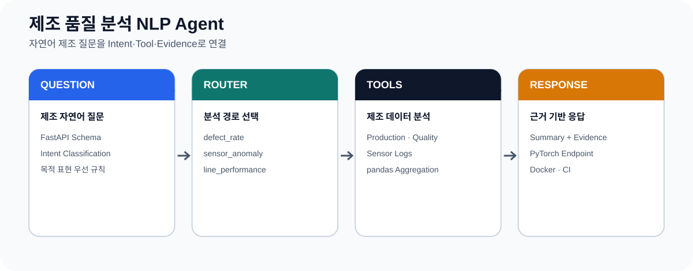
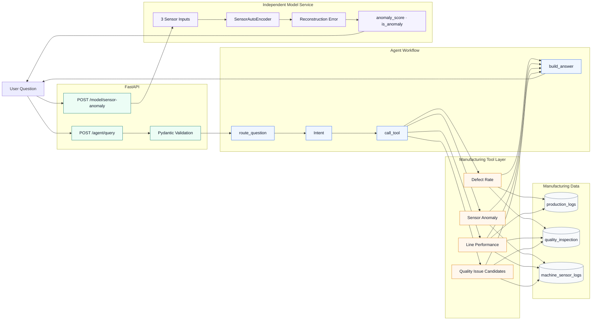
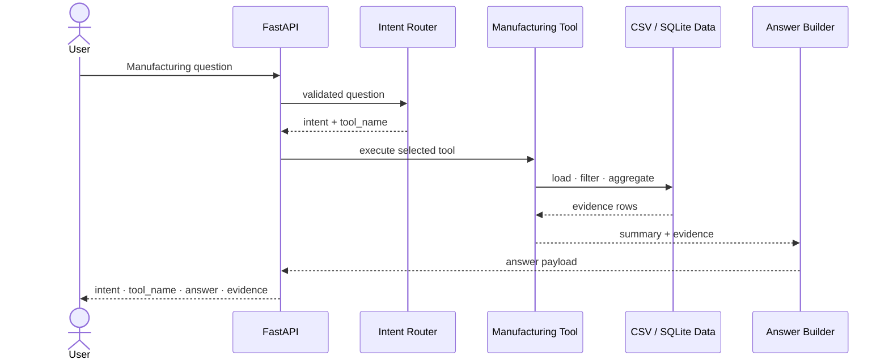

# 제조 품질 분석 NLP Agent

**저장소 ID:** `manufacturing-mcp-agent`

> **제조 자연어 질문을 Intent로 분류하고,
> 필요한 분석 Tool을 실행해 Answer와 Evidence를 반환하는 FastAPI 기반 제조 AI Agent**

<p>
  
  
  
  
</p>

<p align="center">
  
</p>

[Profile](https://github.com/lightleaping) · [Architecture](#4-system-architecture) · [API](#8-api-endpoints) · [Run](#11-how-to-run)

---

## Recruiter Summary

| 구분 | 내용 |
|---|---|
| 형태 | 개인 프로젝트 · AI Agent Backend |
| 문제 | 제조 질문마다 필요한 데이터와 분석 방식이 달라 하나의 함수로 처리하기 어려움 |
| 목표 | 질문 해석과 분석 기능을 분리하고, 실행 결과와 근거 데이터를 함께 반환 |
| 범위 | Intent → Router → Tool → Answer/Evidence + PyTorch Sensor Anomaly Endpoint |
| 내 역할 | 데이터 구조·Intent·Tool·Workflow·API·Model Service·Test·Docker·CI 구현 |
| 핵심 기술 | Python, FastAPI, Pydantic, LangGraph, pandas, PyTorch, SQLite, Docker, GitHub Actions |
| 구현 결과 | **4 Intents · 4 Tools · 2 FastAPI Endpoints · 핵심 테스트 9개** |

---

## Problem → Action → Evaluation

| Problem · 왜 필요한가 | Action · 어떻게 해결했는가 | Evaluation · 무엇으로 검증했는가 |
|---|---|---|
| “불량률”, “센서 이상”, “라인 상태”, “원인 후보” 질문은 필요한 데이터와 계산이 서로 다름 | 질문을 Intent로 분류하고 Router가 독립 Tool을 선택하도록 구현 | Intent·Tool mapping Test |
| 답변만 제공하면 결과의 근거를 다시 확인하기 어려움 | Tool이 `summary`와 원본에 가까운 `evidence`를 함께 반환 | API schema·evidence content Test |
| Agent와 모델 기능을 한 흐름처럼 보이면 책임이 불명확해질 수 있음 | `/agent/query`와 `/model/sensor-anomaly`를 독립 Endpoint로 분리 | Endpoint·service Test |
| 실행 환경 차이로 재현이 어려움 | Docker와 GitHub Actions CI 구성 | pytest·CI |

---

## 1. Why This Project

제조 현장 질문은 자연어이지만 실제 답을 만들려면 서로 다른 데이터 처리 기능이 필요합니다.

- 최근 N일의 라인별 불량률 집계
- 설비 센서 이상 구간 탐지
- 라인별 생산성과 품질 상태 요약
- 불량률과 센서 지표 기반 원인 후보 정리

단순 키워드 답변이 아니라 다음 구조를 구현했습니다.

```text
Question
→ Intent Classification
→ Router
→ Manufacturing Tool
→ Summary + Evidence
→ Answer
```

이 프로젝트에서 NLP 범위는 **자연어 질문의 목적을 Intent로 분류하고 처리 경로를 결정하는 것**입니다. 대규모 언어 모델을 학습한 프로젝트로 과장하지 않습니다.

---

## 2. Scope & Role

### Implemented Scope

| Item | Count / Result |
|---|---:|
| Intent | 4 |
| Manufacturing Tool | 4 |
| FastAPI Endpoint | 2 |
| Core Test | 9 |
| CI | GitHub Actions |
| Container | Docker |

### My Role

- 제조 샘플 데이터 구조 설계
- CSV Data Loading과 집계 로직
- Intent 기준과 우선순위 설계
- LangGraph Workflow 구성
- Tool 함수 분리
- Answer·Evidence 응답 Schema
- PyTorch AutoEncoder Model Service
- FastAPI Endpoint
- pytest·Docker·GitHub Actions

---

## 3. Intent & Tool Mapping

| Intent | Tool | Question Example | Result |
|---|---|---|---|
| `defect_rate` | `get_defect_rate_by_line` | 최근 7일 불량률이 가장 높은 라인은? | Line별 생산량·불량량·불량률 |
| `sensor_anomaly` | `detect_sensor_anomaly` | 진동이 비정상적인 설비를 찾아줘 | 임계값 초과 센서 기록 |
| `line_performance` | `summarize_line_performance` | LINE_A의 생산성과 품질 상태는? | 생산량·불량률·평균 센서값 |
| `quality_issue_candidates` | `find_quality_issue_candidates` | 불량 원인 후보를 알려줘 | 불량률·센서 지표 기반 후보 |

### Routing Decision

키워드 수만 계산하면 “불량 원인”처럼 여러 의미가 포함된 질문이 일반 품질 질문으로 잘못 연결될 수 있습니다.

따라서 다음 우선순위를 적용했습니다.

1. “원인”, “왜”, “후보”처럼 **질문의 목적 표현** 확인
2. 세부 제조 키워드 확인
3. Intent와 Tool 결정
4. Tool 실행 후 Answer·Evidence 반환

---

## 4. System Architecture



> Agent Tool 흐름과 PyTorch AutoEncoder Endpoint는 현재 독립적으로 구현되어 있습니다. AutoEncoder 결과가 Agent Tool에 자동 연결된 것처럼 표현하지 않습니다.

---

## 5. Agent Workflow



---

## 6. Data Layer

### Data Tables

| Table | Purpose |
|---|---|
| `production_logs` | Line별 생산량·작업 정보 |
| `quality_inspection` | 검사 수량·불량 수량·불량 유형 |
| `machine_sensor_logs` | 온도·진동·압력 센서 기록 |

### Processing

- CSV loading
- Date range filtering
- Line grouping
- Sum·mean aggregation
- Defect rate calculation
- Threshold-based sensor anomaly check
- Evidence row construction

---

## 7. PyTorch Sensor Anomaly Endpoint

입력:

- temperature
- vibration
- pressure

처리:

```text
Sensor Values
→ Tensor
→ SensorAutoEncoder
→ Reconstruction Error
→ Threshold 1000.0
→ anomaly_score / is_anomaly
```

이 Endpoint는 Agent Tool의 규칙 기반 센서 이상 탐지와 별도 기능입니다.

---

## 8. API Endpoints

### POST `/agent/query`

Request:

```json
{
  "question": "최근 7일간 불량률이 가장 높은 라인을 찾아줘."
}
```

Response:

```json
{
  "question": "최근 7일간 불량률이 가장 높은 라인을 찾아줘.",
  "intent": "defect_rate",
  "tool_name": "get_defect_rate_by_line",
  "answer": "최근 7일 기준 불량률이 가장 높은 라인은 LINE_C입니다.",
  "evidence": [
    {
      "line_id": "LINE_C",
      "output_qty": 1234,
      "defect_qty": 54,
      "avg_defect_rate": 0.0439
    }
  ]
}
```

### POST `/model/sensor-anomaly`

Request:

```json
{
  "temperature": 95.7,
  "vibration": 5.6,
  "pressure": 2.4
}
```

Response:

```json
{
  "anomaly_score": 1023.5,
  "threshold": 1000.0,
  "is_anomaly": true,
  "model": "SensorAutoEncoder"
}
```

---

## 9. Tech Stack

| Category | Technology | Role |
|---|---|---|
| Language | Python | Agent·Tool·Model·API |
| API | FastAPI, Pydantic | Endpoint·schema validation |
| Workflow | LangGraph | `route_question → call_tool → build_answer` |
| Data | pandas, SQLite | load·filter·aggregate·storage helpers |
| Model | PyTorch | SensorAutoEncoder inference |
| Test | pytest | Agent·Tool·Model service |
| Infra | Docker, GitHub Actions | reproducible run·CI |

---

## 10. Project Structure

```text
manufacturing-mcp-agent/
├── .github/
│   └── workflows/
├── app/
│   ├── agent/
│   ├── api/
│   ├── data/
│   ├── models/
│   ├── tools/
│   └── services/
├── data/
├── docs/
├── langflow/
├── tests/
├── Dockerfile
├── docker-compose.yml
├── README.md
├── requirements.txt
└── pytest.ini
```

---

## 11. How to Run

### Local

```powershell
python -m venv .venv
.\.venv\Scripts\Activate.ps1
python -m pip install -r .\requirements.txt
uvicorn app.main:app --reload
```

### Test

```powershell
python -m pytest .\tests -q
```

### Docker

```powershell
docker compose up --build
```

---

## 12. Limitations & Next Steps

### Current Limitations

- 제조 샘플 데이터 기반으로 실제 공장 데이터의 Scale·Noise·Drift를 반영하지 않음
- Intent는 규칙 기반 중심이며 대규모 NLP 모델 학습 프로젝트가 아님
- Tool의 원인 후보는 상관·임계값 기반으로 실제 인과관계를 확정하지 않음
- AutoEncoder Endpoint는 Agent Tool 흐름과 분리됨
- 인증·권한·운영 모니터링은 구현 범위 밖
- 핵심 테스트 9개로 이후 프로젝트보다 검증 범위가 작음

### Next Steps

1. 구조화 Intent 모델 또는 LLM Intent 비교
2. Agent Tool과 Model Endpoint의 명시적 연결
3. SQLite 실제 적재·조회 경로 통합
4. Tool별 정답 Dataset과 Intent Evaluation
5. Trace·Execution History 추가
6. 실제 제조 데이터 기반 Threshold 재설계

---

## 13. What This Project Demonstrates

- 자연어 질문을 제조 분석 기능으로 연결하는 기본 NLP·Agent 구조 이해
- Intent·Router·Tool의 책임을 분리하는 설계 능력
- Answer와 Evidence를 구분하는 응답 구조
- pandas 기반 제조 데이터 집계
- PyTorch Model Endpoint와 Agent API의 역할 차이 설명
- FastAPI·Docker·CI를 통한 실행 가능한 Backend 구성

---

## Contact

- Developer: 김수진
- GitHub: [github.com/lightleaping](https://github.com/lightleaping)
- Email: workingskyroad@gmail.com
---

## 개편 전 README 보존

적용 스크립트는 교체 전 README를 `docs/archive/README_before_encell.md`와 시간별 백업 파일로 보존합니다. 기존의 긴 개발 기록이나 실행 설명은 삭제하지 않고 해당 문서에서 계속 확인할 수 있습니다.
